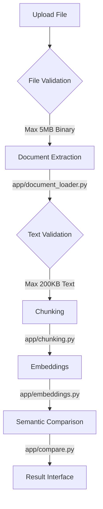

# AI Document Comparison Tool

A semantic document comparison application that finds what changed in *meaning*, rather than just performing line-by-line mechanical text diffs. It leverages local AI embeddings and language models through Ollama for absolute privacy and independence from cloud APIs.

## Problem Solved
Traditional diff tools struggle when prose is rephrased, sentence structures are altered, or formatting changes. This tool understands the underlying *semantics* of the content, easily identifying when a concept was genuinely added, removed, or modified, and gracefully handling stylistic or structural modifications that don't affect intended meaning.

## Key Features
* **Semantic Chunking:** Context-aware paragraph-level segmentation.
* **Concurrent Embeddings:** Multithreaded execution for rapid vector generation.
* **Intelligent Explanations:** Local LLMs explain *why* modified text differs in plain English.
* **Multi-Format Ingestion:** Abstracted, robust document readers isolating formats from logic.
* **Local Processing:** 100% on-device architecture via Ollama.
* **Frontend and API Interfaces:** Extensible Streamlit GUI alongside a FastAPI backend.
* **Automated CI/CD:** Native testing hooks into GitHub Actions.

## Supported Document Formats
* **TXT** / **MD** (Standard utf-8 decoded formats)
* **PDF** (`pypdf` ingestion mapping)
* **DOCX** (`python-docx` ingestion mapping)

## Architectural Workflow
Documents ingested by the application follow this deterministic path, isolating file parsing entirely from downstream AI processes:



## Validation Limits
The pipeline is fortified with two explicit boundaries to ensure stability and resource protection:
1. **Raw Upload:** A strict **5 MB maximum** binary cap to prevent Application Denial of Service via malicious/oversized uploads.
2. **Text Validation:** A rigid **200 KB maximum** text length cap on *extracted* data to enforce deterministic chunking and realistic computation times.

## Technology Stack
- **Backend:** Python 3.12, FastAPI
- **Frontend / UI:** Streamlit
- **Vector Math:** NumPy
- **Document Loading:** `pypdf`, `python-docx`
- **AI Backend Framework:** Ollama
- **Testing Engine:** Pytest

## Project Structure
```text
/app
  __init__.py
  chunking.py         # Defines semantic buffer logic.
  compare.py          # Diff logic and mapping matrices.
  document_loader.py  # Abstracted TXT/PDF/DOCX extraction.
  embeddings.py       # ThreadPoolExecutor mapped embeddings.
  llm.py             # Explanation generative prompts.
  main.py            # FastAPI service registry.
/tests               # 20 Native Pytest asserts testing all core pipelines.
.github/workflows    # GitHub Actions Continuous Integration.
streamlit_app.py     # Main user-interface.
```

## Prerequisites
- **Git**
- **Python 3.12+**
- **Ollama**: Required for running the local inference models.

### Ollama Setup
Ensure the Ollama application is running (`ollama serve`) locally. Then pull the required embedding and explanation local models:
```bash
ollama pull nomic-embed-text
ollama pull llama3.1
```

## Installation
```bash
# 1. Clone the repository
git clone https://github.com/TulasiSankh/ai-document-comparison-tool.git
cd ai-document-comparison-tool

# 2. Setup Virtual Environment
python -m venv venv

# Activate Environment
# Windows:
venv\Scripts\activate
# Mac/Linux:
source venv/bin/activate

# 3. Install core and test dependencies
pip install -r requirements.txt
```

## Running the application
**Streamlit UI** (Recommended):
```bash
streamlit run streamlit_app.py
```
**FastAPI backend**:
```bash
uvicorn app.main:app --reload
```

## Running tests
The application encompasses a thorough 20-test Pytest suite avoiding network calls safely:
```bash
python -m pytest -v
```
*(Tests mock Ollama dependency interfaces directly out-of-the-box).*

## GitHub Actions / CI
Native CI verifies logic against every pull request and push to the `main` branch. This pipeline resides in `.github/workflows/tests.yml` scaling Python `3.12` matrices automatically executing standard coverage.
**Test Result Context:** Currently passing 20/20 successfully!

## Limitations
- Document structures that shift entirely drastically breaking sequential alignments will confuse the *Greedy Aligner* presently operating in `app/compare.py`.
- Image-only scanned PDFs are unsupported and will throw explicit warnings during upload unless ran through external OCR software first.

## Future improvements
- Re-architecting the mapping alignment away from naive greedy matching toward a full dynamic-programming sequence algorthm (Needleman-Wunsch inspired).
- Utilizing built-in caching for repeated comparison executions mapping standard blocks directly natively.
